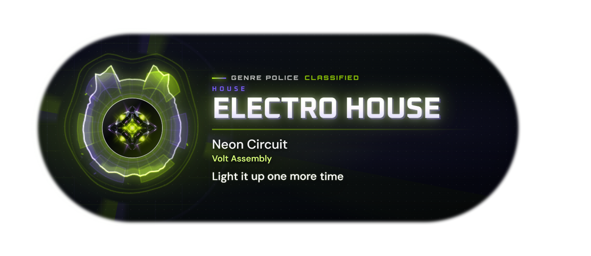
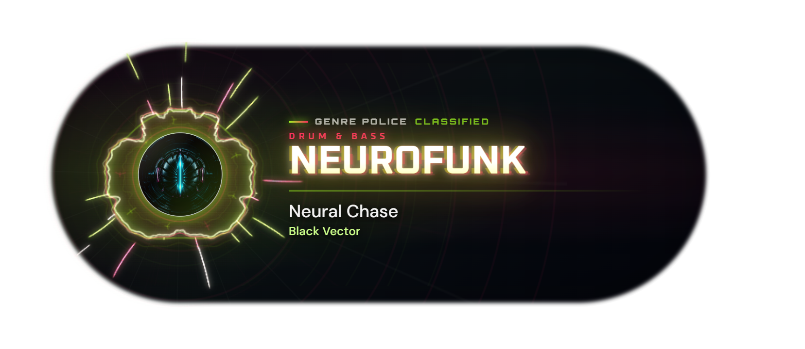
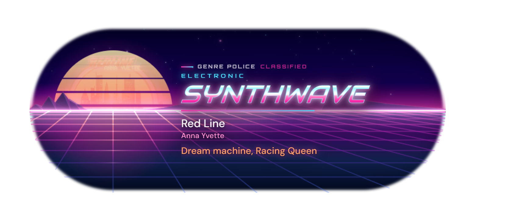
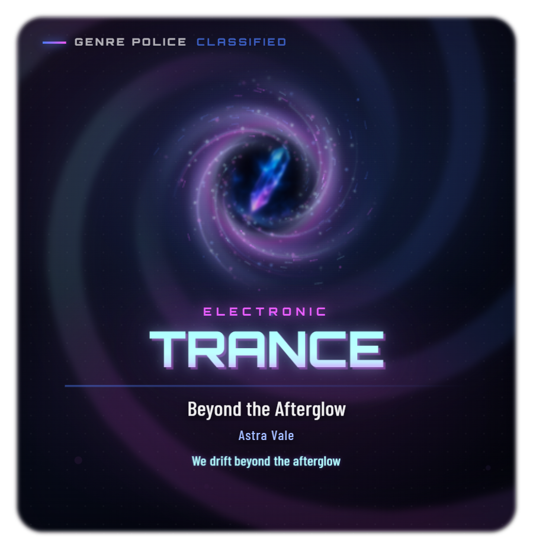
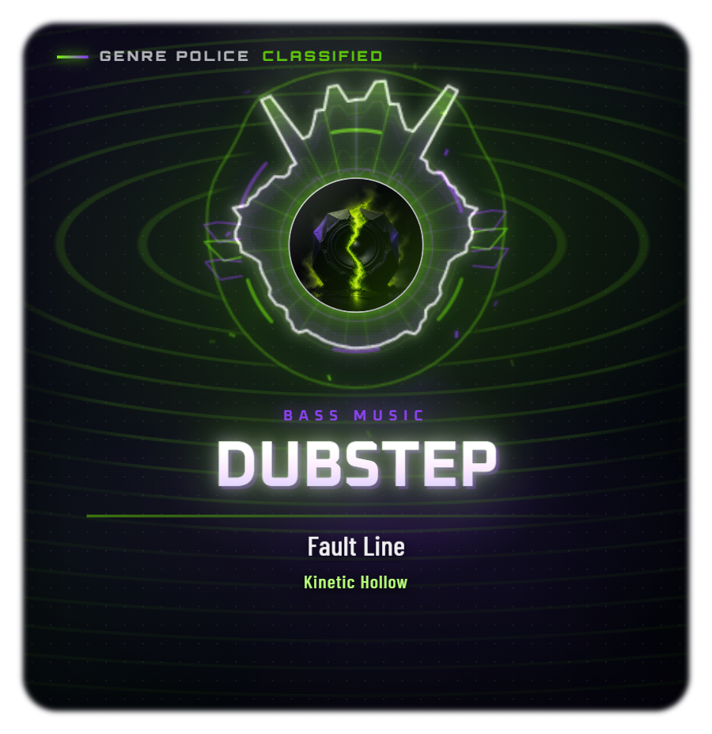

<h1 align="center">Genre Police Visualizer</h1>

<p align="center">A Windows desktop music visualizer that changes its visual language with the music genre</p>

<p align="center">
  <a href="README.md">简体中文</a> · English · <a href="README.ja.md">日本語</a>
</p>

Genre Police Visualizer reads the current Windows media session and analyzes system playback audio. It then attempts to identify the genre and adapts the visualization structure, background, typography, and motion. The goal is not simply to recolor one visualizer, but to give different kinds of music their own visual language.

The current release is the `0.2.0` beta. Its design currently focuses on EDM and covers more than 20 major genre families. Some families have received detailed tuning, while others will continue to be expanded and refined.

## Download

**[Open Releases to download the Windows portable build](../../releases)**

- Requires 64-bit Windows 10 or Windows 11 (x64).
- Download and run `Genre-Police-Visualizer-0.2.0-portable.exe`; no installation is required.
- Node.js, Python, PyTorch, and a separate AI runtime are not required.
- Download `SHA256SUMS.txt` as well if you want to verify the executable.

Version `0.2.0` is not Authenticode-signed. Windows SmartScreen may therefore show an “Unknown publisher” warning. Only download the executable from this project's GitHub Releases page.

## Preview

### Capsule

<p align="center">
  <a href="docs/screenshots/electro-house-capsule.png"></a>
</p>

<p align="center">
  <a href="docs/screenshots/neurofunk-capsule.png"></a>
</p>

<p align="center">
  <a href="docs/screenshots/synthwave-capsule.png"></a>
</p>

### Poster

<p align="center">
  <a href="docs/screenshots/trance-poster.png"></a>
  <a href="docs/screenshots/dubstep-poster.png"></a>
</p>

## Features

- **Genre-aware visuals:** changes the visualization structure, background, type, particles, and motion instead of applying color swaps alone.
- **Two layouts:** capsule and poster layouts keep separate settings and can use either a genre background or an adaptive surface that blends with the desktop wallpaper.
- **Live audio response:** spectrum, rhythm, BPM, energy, and impact feedback are driven by system playback audio, with a bundled local BeatNet ONNX model assisting beat analysis.
- **Now playing and controls:** displays title, artist, album, artwork, playback state, and progress, with previous, play/pause, and next controls.
- **Custom genres:** adds local matching rules by tag alias or artist, reuses an existing visual style for the custom label, and optionally overrides its three theme colors.
- **Synchronized lyrics:** supports synchronized lyrics, word or character highlighting, and translation when available. Lyric timing can be adjusted, and lyric lookup can be disabled completely.
- **Desktop controls:** includes proportional 50%–150% scaling, Standard/Gentle motion, saved window position, media-source selection, mouse passthrough, and configurable idle behavior.
- **Multilingual interface:** the application UI supports Simplified Chinese, English, Japanese, and Korean.

## Compatibility and genre coverage

Genre Police Visualizer can follow any player that publishes a Windows system media session. Apple Music, Spotify, QQ Music, NetEase Cloud Music, Kugou, YouTube Music, Amazon Music, and other compatible players can be used, although the available artwork, progress, or genre metadata may differ between applications and versions.

NetEase Cloud Music may not publish a system media session by default. When the app detects NetEase without a media session, it points to **Settings → System** and the exact **开启SMTC** (Enable SMTC) checkbox.

The current genre coverage includes:

- Hardcore, Hardstyle, House, Future Bass, Dubstep, and EDM Trap
- Drum & Bass, UK Garage, Breakbeat, Techno, Trance, and Synthwave
- Pop, J-Pop, K-Pop, Rock, Metal, Hip-Hop, and R&B
- Common broad families such as Jazz, Classical, Soundtrack, Country, Folk, Latin, and Reggae

Genre classification combines player metadata, public music catalogs, local rules, and remembered user corrections. Hybrid genres, remixes, compilations, and artists who work across several styles can still be classified incorrectly; the displayed result should not be treated as an absolute label.

## Basic use

1. Run the portable EXE.
2. Start playing music in a player that supports Windows system media sessions.
3. The visualizer appears near the lower-right corner of the primary display, with a Genre Police icon in the system tray.
4. Use the top button to switch layouts and the settings panel or tray menu to adjust backgrounds, scaling, lyrics, and motion.

If the visualizer stops responding after switching audio output devices, choose **Recapture system audio** from the tray menu.

## Privacy and network access

- System playback audio is analyzed locally and is never recorded, written to disk, or uploaded.
- The application contains no telemetry, advertising SDK, account system, or automatic crash uploader.
- Online genre lookup and synchronized lyrics can be disabled independently. When enabled, only the metadata required for matching—such as title, artist, album, and duration—is sent to the documented services. Audio is never transmitted.
- The adaptive backdrop derives low-resolution color statistics locally from the area around the window and does not save screenshots.

See the [privacy documentation](docs/PRIVACY.md) for the complete data flow.

## Current limitations

- Only Windows 10/11 x64 is currently supported.
- Complete now-playing information is unavailable when a player does not publish a Windows media session.
- Word-by-word highlighting is usually estimated from line-level timestamps and is not equivalent to a provider-supplied syllable timeline.
- Transparent always-on-top windows may behave differently with some HDR, multi-GPU, remote-desktop, or screen-capture setups.
- This is still a test release. Genre recognition and visual design will continue to be adjusted.

See [Known Issues](docs/KNOWN_ISSUES.md) for more details.

## Documentation

- [Architecture](docs/ARCHITECTURE.md)
- [Privacy](docs/PRIVACY.md)
- [Known Issues](docs/KNOWN_ISSUES.md)
- [Changelog](CHANGELOG.md)
- [Third-party notices and licenses](THIRD_PARTY_NOTICES.md)
- [Security policy](SECURITY.md)

## Running from source

Development requires 64-bit Windows 10/11 and Node.js 22.12 or newer.

```powershell
npm ci
npm start
```

Run the test suite or build the Windows portable executable with:

```powershell
npm test
npm run dist
```

## Feedback and license

Use [Issues](../../issues) for bug reports and suggestions. You may attach the application's redacted diagnostics export, but do not post a Last.fm key, Discogs token, or any other credential publicly.

The project source is available under the [MIT License](LICENSE). Bundled fonts, runtimes, and the local rhythm model retain their respective licenses; see [THIRD_PARTY_NOTICES.md](THIRD_PARTY_NOTICES.md).
